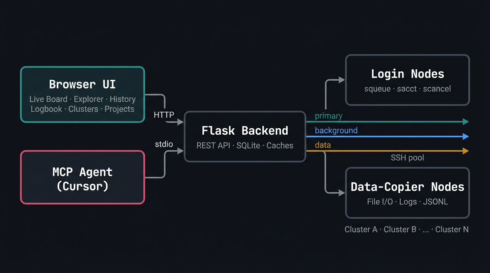

<p align="center">
  
</p>

<h1 align="center">clausius</h1>

<p align="center">
  <em>Research clusters are chaotic. We are here to reverse the entropy.</em><br><br>
  Multi-cluster Slurm dashboard with AI agent integration via MCP.<br>
  Monitor, explore, and manage GPU jobs across HPC clusters from a single browser tab —<br>
  or let your AI coding agent do it through the built-in MCP server.
</p>

## Quick Start

```bash
git clone https://github.com/tamohannes/clausius.git
cd clausius
pip install flask paramiko
cp conf/config.example.json conf/config.json  # edit with your cluster details
python app.py
```

Open [http://localhost:7272](http://localhost:7272)

## Architecture



Three-lane SSH connection pool: **primary** (Slurm control), **background** (metadata), **data** (file I/O routed to data-copier nodes with automatic login-node fallback). AI Hub OpenSearch integration for formal GPU allocations and fairshare data.

## Features

### Live Board
- Multi-cluster job board grouped by run name (active, idle, unreachable, local)
- Slurm dependency chain detection with topological sorting
- Persistent run grouping — completed jobs retain their dependency structure
- Live progress tracking, crash detection (OOM, segfault, traceback)
- Cluster availability tooltip with wait-time estimates, pending reason translation, and team fair-share priority
- Board-pinned terminal jobs persist until dismissed
- Background job dimming for long-running server processes (configurable suffixes)
- Per-GPU utilization and memory charts, CPU utilization, RSS memory tracking
- Configurable GPU stats snapshot interval

### Log Explorer
- Mount-first reads with SSH fallback to data-copier nodes
- Nested directory browsing with lazy-loaded tree
- Syntax-aware rendering for `.json`, `.jsonl`, `.jsonl-async`, `.md`
- Full log pagination, JSONL record viewer, clipboard copy

### History
- SQLite-backed job history with dependency-aware grouping
- Text search, state filters (completed/failed/cancelled/timeout/running/pending)
- Paginated view with configurable page size

### Projects
- Auto-detected projects from job name prefixes
- Per-project detail pages with live jobs, stats, and search
- Customizable project colors and emojis

### Logbook
- Per-project structured entries with BM25 full-text search (FTS5 with porter stemming)
- Two entry types: **note** (experiments, debugging, findings) and **plan** (implementation/research plans)
- Full markdown support: tables, code blocks, blockquotes, links
- `@run-name` references to link to job logs
- `#id` cross-references between entries (rendered as clickable links with title resolution)
- Drag/drop and paste image uploads
- HTML file embeds for interactive figures (plotly, bokeh, matplotlib exports)
- `@` autocomplete for run names in the editor
- Entry IDs displayed in sidebar and detail view for agent communication

### Logbook Map
- Visual map of entry relationships built from `#id` cross-references
- **Tree view**: hierarchical layout with connector lines, sorted by edit time
- **Graph view**: static DAG layout with D3.js, curved directed edges, zoom/pan/drag
- Entry-centric graph: open from any entry's detail page with configurable neighbor depth (1–5 hops or all)
- Edge direction filter: show outgoing, incoming, or both connections
- Focus controls shared between tree and graph views
- Color-coded nodes: neutral for notes, red for plans (matching sidebar)

### Compute (GPU Allocations & Cluster Intelligence)
- **GPU Allocations Dashboard**: Per-cluster cards showing formal PPP allocations, consumption, and fairshare from AI Hub OpenSearch
- **Stacked usage bars**: Side-by-side segments — your running/pending (accent, striped), team running/pending (orange, striped), PPP non-team (gray) — with toggle controls
- **"Where to Submit" strip**: Ranked cluster chips scored by team-aware headroom (considers informal team quota, PPP fairshare, and current usage)
- **Hover popup**: Per-account breakdown with your usage, team, PPP non-team, other PPPs, cluster total, and team alloc
- **Click-through modal**: Full per-user GPU breakdown with running/pending/CPU counts, sorted by usage
- **GPU Usage History**: Chart.js time-series of allocation vs consumption per account with 7d/14d/30d range selector
- **Pending job tooltips**: Fairshare-based wait estimates using AI Hub `level_fs`, plus cross-cluster recommendations filtered by job size and GPU type
- **Mounts**: SSHFS mount/unmount/remount per cluster; mount-all in parallel with progress; stale mount detection via `/proc/mounts` (never blocks on dead FUSE)
- **Storage Quotas**: Lustre filesystem and PPP project quotas

### Settings
- **Profile**: Avatar, username, team name, PPP quota list
- **General**: Theme (system/light/dark), auto-refresh toggle, refresh interval
- **Shortcuts**: Configurable keyboard bindings (toggle sidebar, spotlight, close/next/prev tab, refresh live data)
- **Clusters**: Add/edit/remove clusters, mount controls with restart button
- **Projects**: Prefix, color, and emoji customization
- **Advanced**: SSH timeout, cache freshness, GPU stats interval, database backup interval and retention, history page size, JSONL record limits, background run suffixes, local process include/exclude filters

### UI
- Multi-tab interface with persistent tab state across sessions
- Collapsible sidebar with draggable width
- Spotlight search (Cmd+P): search across projects, logbook entries, and job history
- Loading toasts with animated progress bar for all async actions
- Theme-aware color system with CSS custom properties
- Keyboard shortcuts: Cmd+Shift+R (refresh live), Cmd+S (toggle sidebar), Cmd+P (spotlight), Cmd+W (close tab), Cmd+]/[ (cycle tabs)
- Charts: per-GPU utilization/memory line charts, CPU utilization, RSS memory (Chart.js)
- D3.js for interactive logbook graph visualization

### Database Backups
- Automatic daily backups using SQLite online backup API (safe during writes)
- Configurable backup interval (default: 24 hours) and retention (default: 7 backups)
- Stored in `data/backups/history-YYYY-MM-DD.db`
- Old backups automatically cleaned up

### MCP Server (AI Agent API)
- Stdio-based MCP server for Cursor and other MCP-compatible agents
- 35 tools covering every aspect of the dashboard:

| Category | Tools |
|----------|-------|
| GPU Allocations | `where_to_submit`, `get_ppp_allocations`, `get_gpu_usage_history` |
| Jobs | `list_jobs`, `get_job_log`, `get_job_stats`, `list_log_files` |
| History | `get_history`, `list_projects`, `get_project_jobs` |
| Actions | `cancel_job`, `cancel_jobs` |
| Runs | `get_run_info`, `run_script`, `cleanup_history` |
| Clusters | `get_cluster_status`, `get_team_gpu_status`, `get_cluster_availability`, `get_partitions`, `get_partition_summary`, `recommend_submission`, `get_storage_quota` |
| Mounts | `get_mounts`, `mount_cluster`, `clear_failed`, `clear_completed` |
| Logbook | `list_logbook_entries`, `read_logbook_entry`, `bulk_read_logbooks`, `create_logbook_entry`, `update_logbook_entry`, `delete_logbook_entry`, `search_logbook`, `upload_logbook_image` |

- `where_to_submit(nodes, gpu_type)` — **primary tool** for "where should I submit this job?" — ranks clusters by team headroom, fairshare, and GPU type match
- `get_ppp_allocations()` — formal PPP allocations, consumption, fairshare per account per cluster from AI Hub
- `get_gpu_usage_history()` — daily allocation vs consumption time-series
- `recommend_submission()` — partition-level ranking with fairshare-aware scoring and PPP account recommendation
- `run_script()` — execute Python/bash on a cluster and return stdout/stderr
- Resource: `jobs://summary` — quick text overview of running/pending/failed per cluster
- No SSH, no DB access — wraps the Flask API cleanly

### Performance
- On-demand architecture: clusters are only contacted when a user or agent requests data
- Three-lane SSH connection pool with data-copier node routing
- Per-cluster caching with configurable TTL
- Prefetch warming for running jobs (log index, content, stats)
- Mount status detection via `/proc/mounts` (no filesystem stat, never blocks on stale FUSE)
- No background polling — login nodes are not contacted when nobody is looking

## Setup

### MCP Server

```bash
pip install mcp
```

Add to `~/.cursor/mcp.json`:

```json
{
  "mcpServers": {
    "clausius": {
      "command": "python3",
      "args": ["/path/to/clausius/mcp_server.py"]
    }
  }
}
```

Reload Cursor to activate. Requires the Flask app to be running.

### Cursor Agent Skill

Install the clausius skill so Cursor's agent knows how to use the MCP tools across all your projects:

```bash
mkdir -p ~/.cursor/skills/clausius
cp skills/SKILL.md ~/.cursor/skills/clausius/SKILL.md
```

This registers clausius as a user-level skill. The agent will automatically discover it and use the MCP tools instead of raw SSH commands when you ask about jobs, logs, cluster availability, or submission recommendations.

## Configuration

### config.json

Primary configuration file. Editable from the UI Settings panel or directly.

```json
{
  "port": 7272,
  "clusters": {
    "my-cluster": {
      "host": "login-node.example.com",
      "data_host": "dc-node.example.com",
      "port": 22,
      "gpu_type": "H100",
      "gpus_per_node": 8,
      "mount_paths": ["/lustre/.../users/$USER"]
    }
  },
  "team": "my-team",
  "team_members": ["jack", "bob", "gexam"],
  "ppp_accounts": ["my_ppp_account_1", "my_ppp_account_2"],
  "team_gpu_allocations": {"my-cluster": 500},
  "aihub_opensearch_url": "",
  "dashboard_url": "",
  "aihub_cache_ttl_sec": 300,
  "log_search_bases": ["/lustre/.../users/$USER"],
  "nemo_run_bases": ["/lustre/.../users/$USER/nemo-run"],
  "mount_lustre_prefixes": ["lustre/fsw/..."],
  "local_process_filters": {
    "include": ["my-framework", "python -m my_framework"],
    "exclude": ["cursor", "jupyter"]
  },
  "ssh_timeout": 8,
  "cache_fresh_sec": 30,
  "stats_interval_sec": 1800,
  "backup_interval_hours": 24,
  "backup_max_keep": 7
}
```

| Field | Purpose |
|-------|---------|
| `team` | Team name for dashboard integration |
| `team_members` | List of team member usernames for usage overlay |
| `ppp_accounts` | Slurm PPP accounts to track across clusters |
| `team_gpu_allocations` | Informal per-cluster GPU quotas (number or `"any"`) |
| `aihub_opensearch_url` | OpenSearch endpoint for GPU allocation data |
| `dashboard_url` | Science dashboard URL for team membership fallback |
| `aihub_cache_ttl_sec` | Cache TTL for AI Hub queries (default 300s) |

The optional `data_host` routes file-explorer I/O to a data-copier node, reducing login-node load. Falls back to `host` when omitted or unreachable.

### Environment Variables

- `CLAUSIUS_SSH_USER` (default: `$USER`)
- `CLAUSIUS_SSH_KEY` (default: `~/.ssh/id_ed25519`)
- `CLAUSIUS_MOUNT_MAP` (JSON map of cluster -> mount roots)

## Job Name Prefix Protocol

Jobs are grouped by project using a name prefix convention:

```
<project>_<run-name>
```

| Component | Rules | Example |
|-----------|-------|---------|
| `<project>` | Lowercase letters, digits, hyphens. Starts with a letter. | `my-project`, `eval-suite`, `training` |
| `_` | Required underscore separator | |
| `<run-name>` | The experiment/eval name | `eval-math`, `train-v3` |

The monitor auto-detects projects on first encounter, assigning a color and emoji. Customize in Settings > Projects.

Dependency chain auto-detection from run name suffixes:
- `*-judge-rs<N>` — linked as child of the base eval
- `*-summarize-results` — linked as child of the judge run

## API Endpoints

### Jobs & Clusters

| Method | Endpoint | Purpose |
|--------|----------|---------|
| GET | `/api/jobs` | All clusters with jobs, mounts, dependency info |
| GET | `/api/jobs/<cluster>` | Force-refresh one cluster |
| GET | `/api/run_info/<cluster>/<root_job_id>` | Run metadata (batch script, env, conda/pip, scontrol) |
| GET | `/api/history?cluster=&limit=&project=` | Job history, filterable by cluster and project |
| GET | `/api/projects` | All known projects with job counts |
| GET | `/api/spotlight?q=` | Search across projects, logbook, and history |

### Logs & Files

| Method | Endpoint | Purpose |
|--------|----------|---------|
| GET | `/api/log_files/<cluster>/<job_id>` | Discover log files |
| GET | `/api/log/<cluster>/<job_id>?path=&lines=` | Read log content (tail) |
| GET | `/api/log_full/<cluster>/<job_id>?path=&page=` | Full log with pagination |
| GET | `/api/ls/<cluster>?path=` | Directory listing |
| GET | `/api/jsonl_index/<cluster>/<job_id>?path=&mode=` | JSONL file index |
| GET | `/api/jsonl_record/<cluster>/<job_id>?path=&line=` | Single JSONL record |

### Stats & Prefetch

| Method | Endpoint | Purpose |
|--------|----------|---------|
| GET | `/api/stats/<cluster>/<job_id>` | Job resource stats (GPU/CPU/memory) with time series |
| POST | `/api/prefetch_visible` | Prefetch log index, content, and stats for visible jobs |
| POST | `/api/progress` | Batch-fetch progress for multiple jobs |

### Actions

| Method | Endpoint | Purpose |
|--------|----------|---------|
| POST | `/api/cancel/<cluster>/<job_id>` | Cancel a single job |
| POST | `/api/cancel_jobs/<cluster>` | Cancel multiple jobs (JSON body: `job_ids`) |
| POST | `/api/run_script/<cluster>` | Run script on cluster via SSH |
| POST | `/api/clear_failed/<cluster>` | Dismiss all failed pins |
| POST | `/api/clear_cancelled/<cluster>` | Dismiss cancelled pins |
| POST | `/api/clear_completed/<cluster>` | Dismiss completed pins |
| POST | `/api/cleanup` | Delete old history records |

### GPU Allocations (AI Hub)

| Method | Endpoint | Purpose |
|--------|----------|---------|
| GET | `/api/aihub/allocations` | PPP allocations, fairshare, cluster occupancy |
| GET | `/api/aihub/history?days=&cluster=` | Allocation vs consumption time-series |
| GET | `/api/aihub/users?account=&cluster=&days=` | Per-user GPU breakdown for an account |
| GET | `/api/aihub/team_overlay` | Team member usage across all accounts |
| GET | `/api/team_jobs?cluster=` | Running/pending/dependent jobs per user across PPP accounts |

### Partitions & Recommendations

| Method | Endpoint | Purpose |
|--------|----------|---------|
| GET | `/api/partitions` | Partition data for all clusters |
| GET | `/api/partitions/<cluster>` | Partition data for one cluster |
| GET | `/api/partition_summary` | Compact cross-cluster partition overview |
| POST | `/api/recommend` | Recommend best cluster+partition+account for a job (JSON body) |
| GET | `/api/storage_quota/<cluster>` | Lustre filesystem and PPP quotas |

### Mounts & Settings

| Method | Endpoint | Purpose |
|--------|----------|---------|
| GET | `/api/mounts` | Mount status for all clusters |
| POST | `/api/mount/<action>/<cluster>` | Mount/unmount one cluster |
| POST | `/api/mount/<action>` | Mount/unmount all clusters |
| GET | `/api/settings` | Current configuration |
| POST | `/api/settings` | Update configuration (hot-reload) |

### Logbooks

| Method | Endpoint | Purpose |
|--------|----------|---------|
| GET | `/api/logbook/<project>/entries?q=&sort=&limit=&type=` | List or BM25-search entries |
| POST | `/api/logbook/<project>/entries` | Create entry `{title, body, entry_type}` |
| GET | `/api/logbook/<project>/entries/<id>` | Read single entry |
| PUT | `/api/logbook/<project>/entries/<id>` | Update entry `{title?, body?, entry_type?}` |
| DELETE | `/api/logbook/<project>/entries/<id>` | Delete entry |
| GET | `/api/logbook/search?q=&project=&from=&to=` | Cross-project BM25 search |
| POST | `/api/logbook/<project>/images` | Upload image or HTML file |
| GET | `/api/logbook/<project>/images/<filename>` | Serve uploaded file |
| GET | `/api/logbook/<project>/map` | Map data (nodes + links from #id refs) |

## Systemd (User Service)

```ini
[Unit]
Description=clausius — Research clusters are chaotic. We are here to reverse the entropy.
After=network.target

[Service]
Type=simple
WorkingDirectory=%h/ncluster
ExecStart=%h/miniconda3/bin/python %h/ncluster/app.py
Restart=always
RestartSec=5
TimeoutStopSec=10
KillMode=mixed

[Install]
WantedBy=default.target
```

```bash
systemctl --user daemon-reload
systemctl --user enable --now clausius.service
```

## Testing

442 tests across unit, integration, and MCP layers.

```bash
pip install pytest pytest-cov
pytest -m "not live"         # all deterministic tests (no SSH, no cluster)
pytest -m unit               # unit tests only
pytest -m integration        # Flask test client with mock cluster
pytest -m mcp                # MCP tool contracts
pytest -m live               # real cluster tests (requires running app)
```

| Layer | Directory | What it covers |
|-------|-----------|----------------|
| Unit | `tests/unit/` | Parsers, DB ops, cache, mount resolution, config, entry refs |
| Integration | `tests/integration/` | All Flask routes via test client, logbook map, storage quota |
| MCP | `tests/mcp/` | Tool contracts, bulk read, transport errors, edge cases |
| Live | `tests/live/` | Real SSH/Slurm reads + job cancel |

CI runs without `config.json` — falls back to `config.example.json` with a mock cluster.

## Built With

- **Backend**: Python, Flask, Paramiko, SQLite (FTS5)
- **Frontend**: Vanilla JS, CSS custom properties, Chart.js, D3.js (no build step)
- **Agent API**: MCP (Model Context Protocol)
- **Infrastructure**: SSH connection pooling, SSHFS mounts, systemd

## License

MIT
